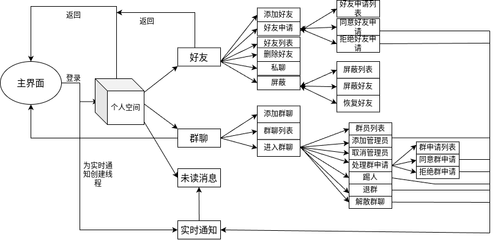

# c++聊天室

## 概述
这是一个基于c++开发的多用户即时通讯聊天室，能够实现多个客户端实时聊天和收发文件

## 技术要点
Epoll 边缘触发 (ET) 模式：服务器使用 epoll 的边缘触发模式（ET）来监控多个文件描述符的事件，只有在文件描述符状态变化时才会通知应用程序，从而减少了重复通知和无效的系统调用，提高了服务器的处理效率。

非阻塞 IO：服务器设置 socket 为非阻塞模式，read 和 write 操作在没有数据时立即返回，而不会阻塞，从而确保服务器能够同时处理多个连接请求。

线程池：服务器采用了线程池避免频繁创建和销毁线程的开销。同时能够限制最大并发量，防止服务器因资源耗尽而崩溃。

客户端双线程：客户端应用程序采用了双线程架构，一个线程专门用于处理用户界面和输入，另一个线程负责实时通知

多用户支持与群聊功能：系统支持用户之间的好友添加、私聊以及群组聊天，能够处理多人同时在线，保证了高并发条件下的稳定性和响应速度

## 客户端流程图

## 前置条件

要构建和运行此项目，您需要具备以下环境：

- C++ 编译器（如 g++）
- CMake（版本 3.10 或更高）
- hiredis库
- nloman json库

## 安装与构建指南

1. 克隆仓库：

   ```bash
   git clone <your-repository-url>
   cd chatroom
   ```

2. 构建服务器和客户端：

   ```bash
   mkdir build
   cd build
   cmake ..
   make
   ```

3. 运行服务器：

   ```bash
   ./server
   ```

4. 运行客户端：

   ```bash
   ./client
   ```

## 使用说明

- **启动服务器**：在客户端连接之前，请确保服务器正在运行。
- **连接客户端**：启动客户端应用程序，注册新账号或使用已有账号登录。
- **管理好友**：添加或删除好友，并开始会话。
- **群聊**：创建群组并参与群组聊天。
- **文件共享**：使用文件共享功能在客户端之间发送文件。

## 项目结构

```
chatroom/
├── server/                 # 服务器端代码
├── client/                 # 客户端代码
│   ├── CMakeLists.txt      # 客户端的 CMake 配置
│   ├── clientmain.cpp      # 客户端应用程序的主入口
│   ├── menu.cpp            # 客户端菜单管理
│   ├── friend.cpp          # 好友管理模块
│   ├── group.cpp           # 群聊模块
│   ├── sign.cpp            # 注册和登录模块
│   ├── file.cpp            # 文件处理模块
├── Error.hpp               # 客户端错误处理
├── Message.hpp             # 处理json序列化和反序列化
├── Redis.hpp               # 封装对redis数据库的操作
├── Tasksocket.hppp         # 对socket操作的一些封装，包括处理粘包等
├── Threadmanage.hpp        # 线程池类
├── README.md               # 项目 README 文件（本文件）

